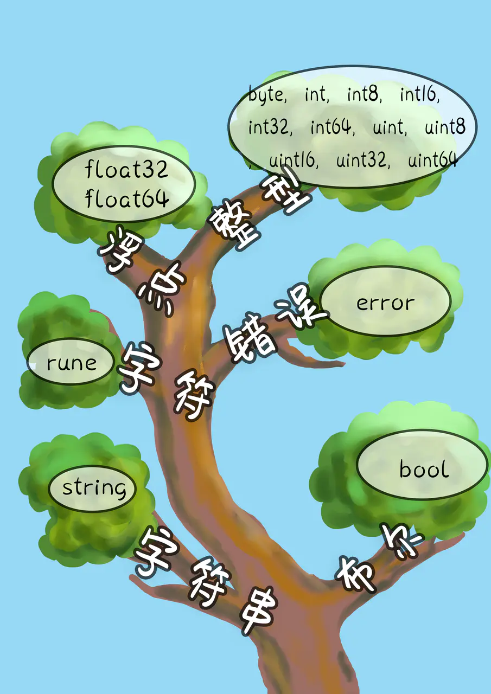
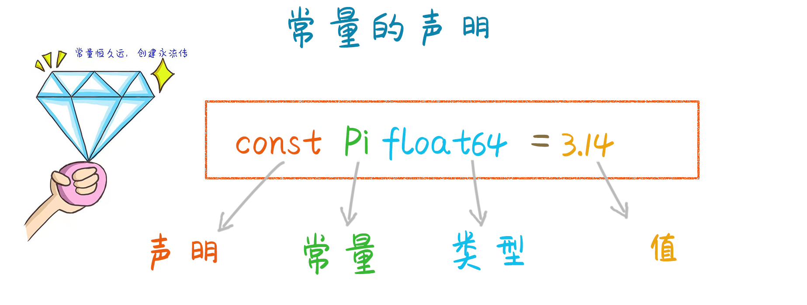
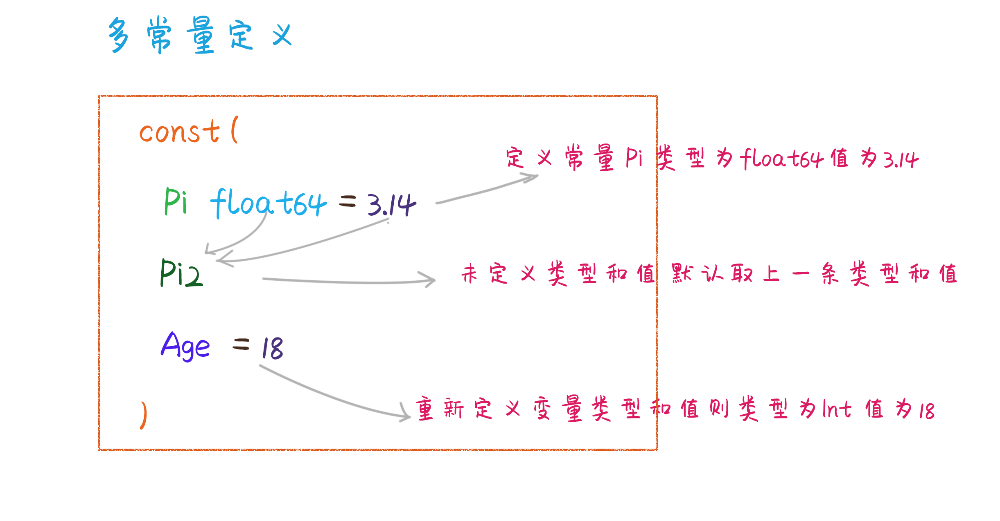
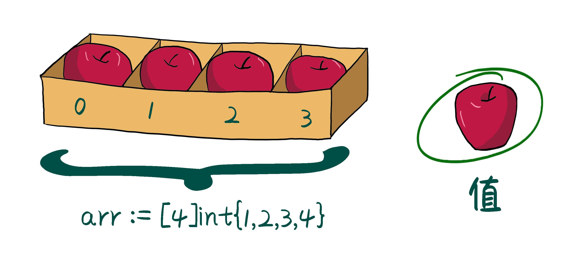
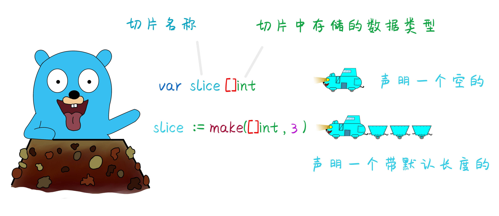
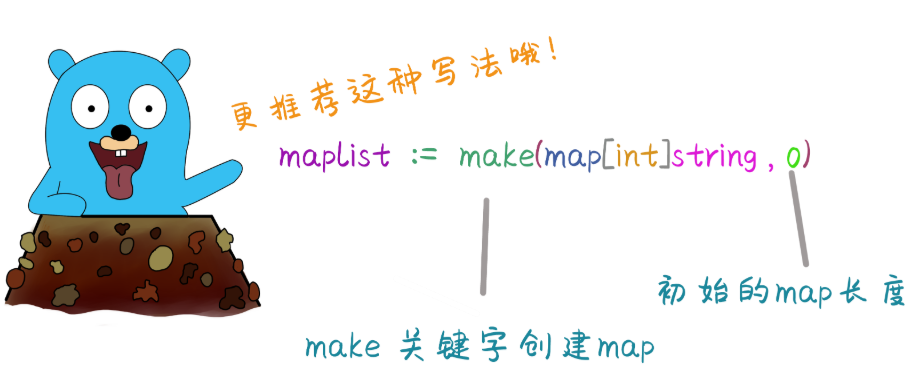

## 数据类型




### 1、基本类型
> Go 拥有各种类型，包括字符串，整形，浮点型，布尔型等。字符串可以通过 + 连接，整形，浮点型，布尔型的运算。下面是一些基本的例子。

[1] 打开GoLand编辑器，新建[values.go](https://github.com/spectrelb/go-example/blob/master/20200712/values.go)文件
```go
package main
import "fmt"
func main() {
	fmt.Println("go" + "lang")
	fmt.Println("1+1 =", 1+1)
	fmt.Println("7.0/3.0 =", 7.0/3.0)
	fmt.Println(true && false)
	fmt.Println(true || false)
	fmt.Println(!true)
}
```
[2] 执行 go run values.go，得到以下结果
```text
golang
1+1 = 2
7.0/3.0 = 2.3333333333333335
false
true
false
```

### 2、变量
> Go是静态类型语言，不能在运行期间改变变量类型。

[1] 打开GoLand编辑器，新建[variables.go](https://github.com/spectrelb/go-example/blob/master/20200712/variables.go)文件
```go
package main
import "fmt"
func main() {
    var a string = "土拨鼠" //var 声明变量，也可以申请多个
    fmt.Println(a)

    var b, c int = 1,2  //一次性声明多个变量。
    fmt.Println(b,c)

    var d = true        // go 将自动推断已经初始化的变量类型。
    fmt.Println(d)

    e := "blockchain"  // := 语句是申明并初始化变量的简写，等价于 var f string = "blockchain"。
    fmt.Println(e)

    /**
    基本类型的默认值
    int --------> 0
    string --------> " "
    bool --------> false
    float --------> 0.0
     */
	var f int          // 声明变量且没有给出对应的初始值时，变量将会初始化为默认值。
	fmt.Println(f)

	g, _ := 100, 200 // _标识匿名变量，这里第二个值200赋给了_， 表示后续代码不需要再用此变量
	fmt.Println(g)

    var(
        age1 = 100
        age2 = 200
    )                 // 如果是多种类型 也可以使用集合
    age1, age2 = age2, age1  //可以轻松实现交换变量的值
    fmt.Println(age1, age2)
}
```

[2] 执行 go run variables.go，得到以下结果
```text
土拨鼠
1 2
true
blockchain
0
100
200 100
```
### 3、常量

> 常量的定义与变量类似，只不过使用 const 关键字，代表永远是只读的，不能修改。




[1] 打开GoLand编辑器，新建[constant.go](https://github.com/spectrelb/go-example/blob/master/20200712/constant.go)文件
```go
package main

import (
	"fmt"
	"math"
)

// const 用于声明一个常量
const a string = "constant"

func main() {
	fmt.Println(a)

	const  b = 123
	fmt.Println(b)

	//常数表达式可以执行任意精度的运算
	const  c = 100 / 3
	fmt.Println(c)

	//数值型常量是没有确定的类型的，直到它们被给定了一个类型，比如说一次显示的类型转化。
	fmt.Println(float64(c))

	//函数调用方式获取pi值
	fmt.Println(math.Pi)

	//iota特殊的常量,iota是常量里面的计数器，初始值默认值是0，可以被编译器自动修改，每定义一组常量时，iota逐行自增1。
	const (
		A = iota  //为 0
		B       //默认和上一行一样，iota加1   为1
		C		//默认和上一行一样，iota加1   为2
	)

	const (
		D= iota
	)

	fmt.Println(A, B, C, D)
	fmt.Println(1<<10)
}
```

[2] 执行 go run constant.go，得到以下结果
```text
constant
123
33
33
3.141592653589793
0 1 2 0
1024
```

[3] 几个常见的iota示例:
```text
//使用_跳过某些值
const (
    n1 = iota //0
    n2        //1
    _
    n4        //3
)

//iota声明中间插队
const (
    n1 = iota //0
    n2 = 100  //100
    n3 = iota //2
    n4        //3
)
const n5 = iota //0

//计算大小
const (
    _  = iota               // 这里用的匿名变量，默认值 0开始
    KB = 1 << (10 * iota)   // 这里 iota 数值是1  1 << 10 =10 即1*2的10次方等于1024
    MB = 1 << (10 * iota)
    GB = 1 << (10 * iota)
    TB = 1 << (10 * iota)
    PB = 1 << (10 * iota)
)

//多个iota定义在一行
const (
    a, b = iota + 1, iota + 2 //1,2
    c, d                      //2,3
    e, f                      //3,4
)
```

### 4、数组
> 数组



[1] 打开GoLand编辑器，新建[arrays.go](https://github.com/spectrelb/go-example/blob/master/20200714/arrays.go)文件
```go
package main

import "fmt"

func main() {
	// 这里我们创建了一个数组 `a` 来存放刚好 5 个 `int`。 数组默认是零值的，对于 `int` 数组来说也就是 `0`。
	var  a [5]int
	fmt.Println("emp:", a)

	// 我们可以使用 `array[index] = value` 语法来设置数组，或者用 `array[index]` 得到值。
	a[1] = 222
	fmt.Println("set:", a)
	fmt.Println("get:", a[1])

	// 使用内置函数 `len` 返回数组的长度。
	fmt.Println("len:", len(a))

	// 使用短语法在一行内声明并初始化一个数组。
	b := [5]int{1,2,3,4,5}
	fmt.Println(b)

	//构建二维数组
	two := [2][3]int{{1,2,3},{2,3,4}}
	fmt.Println(two)
}
```

[2] 执行 go run arrays.go，得到以下结果
```text
emp: [0 0 0 0 0]
set: [0 222 0 0 0]
get: 222
len: 5
[1 2 3 4 5]
[[1 2 3] [2 3 4]]
```

### 5、切片
> Slice 是 Go 中一个关键的数据类型，是一个比数组更加强大的序列接口



[1] 打开GoLand编辑器，新建[slices.go](https://github.com/spectrelb/go-example/blob/master/20200714/slices.go)文件
```go
package main

import "fmt"

func main() {

	// 这里我们创建了一个长度为5的 `int` 类型 slice（初始化为零值）。
	a := make([]int, 5)
	fmt.Println("emp:", a)

	// 我们可以和数组一样设置和得到值
	a[0] = 1
	a[1] = 2
	a[2] = 3
	fmt.Println("set:", a)
	fmt.Println("get:", a[1])

	// 使用内置函数 `len` 返回slice的长度。
	fmt.Println("len:", len(a))

	// 这是一个内建的 `append`，它返回一个包含了一个或者多个新值的 slice。 由于 `append` 可能返回新的 slice，我们需要接受其返回值。
	a = append(a, 6)
	a = append(a, 7,8,9)
	fmt.Println("emp:", a)

	// Slice 也可以被 `copy`。相同长度的 slice `b`，并且将 `a` 复制给 `b`。
	b := make([]int, len(a))
	copy(b, a)
	fmt.Println("copy:", b)

	// Slice 通过 `slice[low:high]` 语法进行“切片”操作。
	// 这个 slice 从 `a[0]` 切片到 `a[2]`（不包含）。
	c := a[0:2]
	fmt.Println("sli1:", c)

	// 这个 slice 从 `a[0]` 切片到 `a[2]`（不包含）。
	d := a[:2]
	fmt.Println("sli2:", d)

	// 这个 slice 从 `a[2]` 切片（包含）开始切片。
	e := a[2:]
	fmt.Println("sli3", e)

	// 使用短语法在一行内声明并初始化一个slice 。
	f := []string{"a", "b"}
	fmt.Println(f)

	//构建二维slice,每一个slice的长度可以不一致
	two := [][]string{{"a"}, {"b", "c"},{"d", "e","f"}}
	fmt.Println(two)
}
```

[2] 执行 go run slices.go，得到以下结果
```text
emp: [0 0 0 0 0]
set: [1 2 3 0 0]
get: 2
len: 5
emp: [1 2 3 0 0 6 7 8 9]
copy: [1 2 3 0 0 6 7 8 9]
sli1: [1 2]
sli2: [1 2]
sli3 [3 0 0 6 7 8 9]
[a b]
[[a] [b c] [d e f]]
```


### 6、map
> map 是 Go 内置关联数据类型（在一些其他的语言中称为哈希 或者字典 ）。



[1] 打开GoLand编辑器，新建[maps.go](https://github.com/spectrelb/go-example/blob/master/20200714/maps.go)文件
```go
package main

import "fmt"

func main() {

	// 要创建一个空 map, `make(map[key-type]val-type)`.
	a := make(map[int]int)
	fmt.Println(a)

	// 使用典型的 `make[key] = val` 语法来设置键值对。
	a[1] = 1
	a[2] = 2
	fmt.Println("map:", a)

	// 我们可以和数组一样设置和得到值
	a[1] = 3
	fmt.Println("set:", a)
	fmt.Println("get:", a[1])

	// 使用内置函数 `len` 返回map的长度。
	fmt.Println("len:", len(a))

	// 内建的 `delete` 可以从一个 map 中移除键值对
	delete(a, 1)
	fmt.Printf("map: %v, len:%v\n", a, len(a))

	// 使用短语法在一行内声明并初始化一个map。
	b := map[int]int{1:1, 2:2}
	fmt.Println(b)
}
```

[2] 执行 go run maps.go，得到以下结果
```text
map[]
map: map[1:1 2:2]
set: map[1:3 2:2]
get: 3
len: 2
map: map[2:2], len:1
map[1:1 2:2]
```

### 7、指针
> 指针是存储另一个变量的内存地址的变量。

[1] 打开GoLand编辑器，新建[pointers.go](https://github.com/spectrelb/go-example/blob/master/20200714/pointers.go)文件
```go

```

[2] 执行 go run pointers.go，得到以下结果
```text

```

### 8、结构体
> 

[1] 打开GoLand编辑器，新建[structs.go](https://github.com/spectrelb/go-example/blob/master/20200714/pointers.go)文件
```go

```

[2] 执行 go run pointers.go，得到以下结果
```text

```