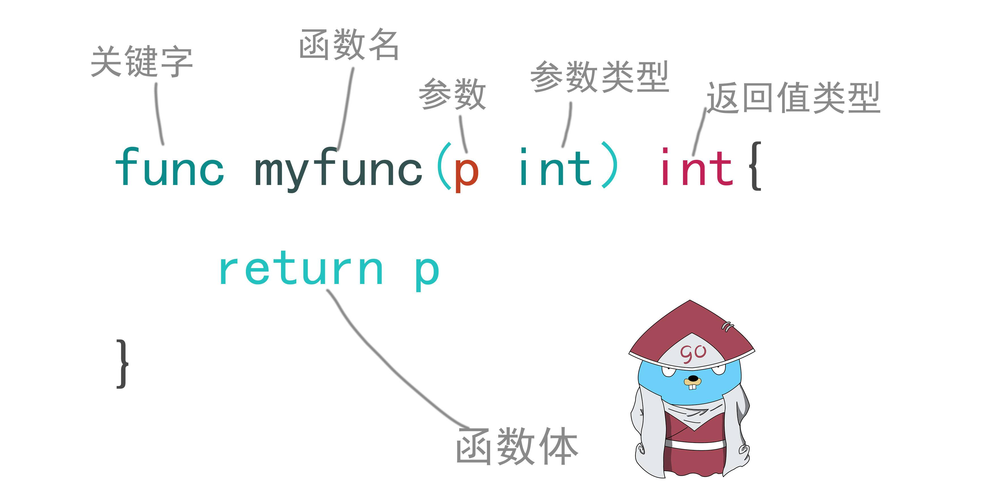

## 函数

### 1、函数
> 函数 是 Go 的中心。我们将通过一些不同的例子来进行学习。



[1] 打开GoLand编辑器，新建[functions.go](https://github.com/spectrelb/go-example/blob/master/20200714/functions.go)文件
```go
package main

import "fmt"

func main() {
	//单返回值函数
	fmt.Println(add(1, 2))
	fmt.Println(add2(1, 2, 3))

	//多返回值函数
	fmt.Println(add3(1, 2, 3))

	//变参函数
	fmt.Println(add4(1, 2, 3))
	fmt.Println(add4(1, 2, 3, 4))

	// 如果有一个含有多个值的 slice，想把它们作为参数, 这样调用 `func(slice...)`。
	a := []int{1,2,3,4}
	fmt.Println(add4(a...))

	//匿名函数：在你想定义一个不需要命名的内联函数时是很实用的。
	nextInt := intSeq()

	// 通过多次调用 `nextInt` 来看看闭包的效果。
	fmt.Println(nextInt())
	fmt.Println(nextInt())
	fmt.Println(nextInt())

	// 为了确认这个状态对于这个特定的函数是唯一的，我们重新创建并测试一下。
	nextInt1 := intSeq()
	fmt.Println(nextInt1())

	//测试多返回值闭包
	nextInt2 := intSeq1(1, 3)
	fmt.Println(nextInt2())
	fmt.Println(nextInt2())
	fmt.Println(nextInt2())

	//递归
	fmt.Println(fact(5))
}

// 这里是一个函数，接受两个 `int` 并且以 `int` 返回它们的和
func add(a int, b int) int {
	return a + b
}

// 当多个连续的参数为同样类型时
func add2(a , b, c int) int {
	return a + b + c
}

//多返回值函数
func add3(a , b, c int) (int, int) {
	return add(a, b), c
}

//变参函数
func add4(nums ... int) int {
	fmt.Print(nums, " ")
	total := 0
	for _, num := range nums {
		total += num
	}
	return total
}

//匿名函数
func intSeq() func() int  {
	i := 0
	return func() int {
		i++
		return i
	}
}

func intSeq1(a, b int) func() (int, int)  {
	i := 0
	return func() (int, int)  {
		i++
		return a + b, i
	}
}

//递归，`fact` 函数在到达 `fact(0)` 前一直调用自身。
func fact(n int) int {
	if n == 0 {
		return 1
	}

	j := fact(n - 1)
	i := n * j

	fmt.Printf("结果为：%v*%v=%v\n", n,j, i)

	return i
}
```

[2] 执行 go run functions.go，得到以下结果
```text
3
6
3 3
[1 2 3] 6
[1 2 3 4] 10
[1 2 3 4] 10
1
2
3
1
4 1
4 2
4 3
结果为：1*1=1
结果为：2*1=2
结果为：3*2=6
结果为：4*6=24
结果为：5*24=120
120
```
